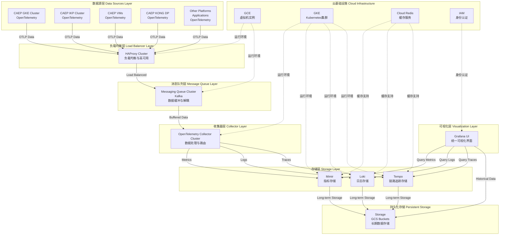
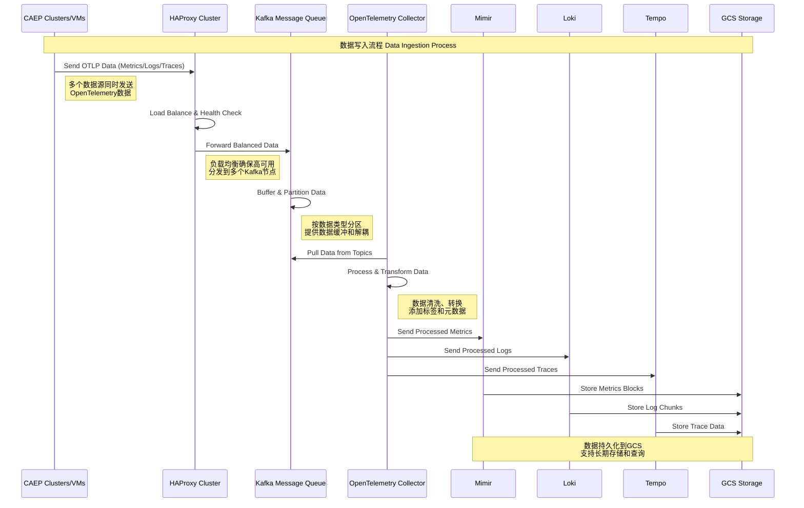
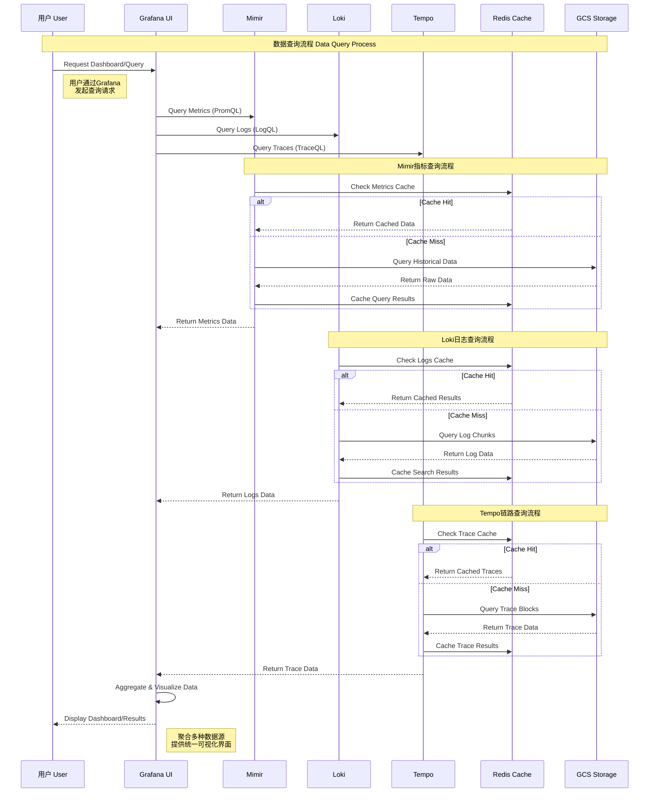

# OpenTelemetry 可观测性平台生产环境部署指南
# OpenTelemetry Observability Platform Production Deployment Guide

## 📋 目录 | Table of Contents

- [概述 | Overview](#概述--overview)
- [架构设计 | Architecture Design](#架构设计--architecture-design)
- [组件说明 | Components Description](#组件说明--components-description)
- [部署前准备 | Pre-deployment Preparation](#部署前准备--pre-deployment-preparation)
- [部署步骤 | Deployment Steps](#部署步骤--deployment-steps)
- [配置说明 | Configuration Details](#配置说明--configuration-details)
- [监控和维护 | Monitoring and Maintenance](#监控和维护--monitoring-and-maintenance)
- [故障排除 | Troubleshooting](#故障排除--troubleshooting)
- [性能优化 | Performance Optimization](#性能优化--performance-optimization)

---

## 🎯 概述 | Overview

### 中文概述

本项目提供了一套完整的基于 OpenTelemetry 的可观测性平台生产环境部署方案，运行在 Google Kubernetes Engine (GKE) 上。该方案采用了 Grafana 可观测性堆栈的核心组件：

- **Mimir**: 高性能、高可用的 Prometheus 兼容时序数据库
- **Loki**: 分布式日志聚合系统  
- **Tempo**: 分布式链路追踪系统
- **Redis**: 高性能缓存层，用于查询加速

该方案专为生产环境设计，具备以下特点：
- ✅ 无状态部署，易于扩展和维护
- ✅ 高可用性，支持多副本和故障转移
- ✅ 高性能，使用 Redis 缓存优化查询
- ✅ 安全性，包含网络策略和身份认证
- ✅ 云原生，充分利用 GCP 服务（GCS、Redis）

### English Overview

This project provides a complete production-ready OpenTelemetry-based observability platform deployment solution running on Google Kubernetes Engine (GKE). The solution uses core components from the Grafana observability stack:

- **Mimir**: High-performance, highly available Prometheus-compatible time series database
- **Loki**: Distributed log aggregation system
- **Tempo**: Distributed tracing system  
- **Redis**: High-performance cache layer for query acceleration

This solution is designed specifically for production environments with the following features:
- ✅ Stateless deployment, easy to scale and maintain
- ✅ High availability with multi-replica and failover support
- ✅ High performance with Redis cache optimization for queries
- ✅ Security with network policies and authentication
- ✅ Cloud-native, fully leveraging GCP services (GCS, Redis)

---

## 🏗️ 架构设计 | Architecture Design

### 整体架构图 | Overall Architecture



### 数据写入流程 | Data Ingestion Flow



### 数据查询流程 | Data Query Flow



---

## 🔧 组件说明 | Components Description

### HAProxy Cluster - 负载均衡层 | Load Balancer Layer

**中文说明**:
- **用途**: 为 OpenTelemetry 数据提供高可用负载均衡
- **特性**: 
  - 支持多种负载均衡算法（轮询、最少连接、权重等）
  - 提供健康检查，自动剔除故障节点
  - SSL终止和HTTP/2支持
  - 支持会话保持和连接复用
- **部署**: 运行在 GCE 虚拟机上，支持多实例高可用
- **配置**: 支持动态配置更新，无需重启服务

**English Description**:
- **Purpose**: Provides high-availability load balancing for OpenTelemetry data
- **Features**:
  - Supports multiple load balancing algorithms (round-robin, least connections, weighted)
  - Provides health checks with automatic failover
  - SSL termination and HTTP/2 support
  - Supports session persistence and connection multiplexing
- **Deployment**: Runs on GCE VMs with multi-instance high availability
- **Configuration**: Supports dynamic configuration updates without service restart

### Kafka Message Queue - 消息队列层 | Message Queue Layer

**中文说明**:
- **用途**: 为可观测性数据提供可靠的消息缓冲和解耦
- **特性**:
  - 高吞吐量数据处理，支持数百万消息/秒
  - 数据持久化，防止数据丢失
  - 分区机制，支持水平扩展
  - 消费者组管理，支持多消费者并行处理
- **数据分区**: 按数据类型（metrics、logs、traces）分区
- **保留策略**: 配置合适的数据保留时间，平衡性能和存储成本

**English Description**:
- **Purpose**: Provides reliable message buffering and decoupling for observability data
- **Features**:
  - High throughput data processing, supporting millions of messages/second
  - Data persistence to prevent data loss
  - Partitioning mechanism for horizontal scaling
  - Consumer group management for parallel processing
- **Data Partitioning**: Partitioned by data type (metrics, logs, traces)
- **Retention Policy**: Configured retention time balancing performance and storage costs

### OpenTelemetry Collector Cluster - 收集器层 | Collector Layer

**中文说明**:
- **用途**: 统一的可观测性数据收集、处理和路由中心
- **特性**:
  - 支持多种数据格式和协议转换
  - 数据采样、过滤和丰富化处理
  - 批处理优化，提高传输效率
  - 支持多目标导出，灵活的数据路由
- **处理器**: 包含属性处理器、资源检测器、批处理器等
- **导出器**: 支持 Prometheus、Jaeger、OTLP 等多种格式

**English Description**:
- **Purpose**: Unified observability data collection, processing, and routing center
- **Features**:
  - Supports multiple data format and protocol conversions
  - Data sampling, filtering, and enrichment processing
  - Batch processing optimization for improved transmission efficiency
  - Multi-target export support with flexible data routing
- **Processors**: Includes attribute processors, resource detectors, batch processors
- **Exporters**: Supports Prometheus, Jaeger, OTLP and other formats

### Mimir - 指标存储 | Metrics Storage

**中文说明**:
- **用途**: 存储和查询 Prometheus 兼容的时序指标数据
- **特性**: 
  - 支持水平扩展，可处理数百万个时间序列
  - 使用 GCS 作为长期存储，成本效益高
  - 多层缓存架构（Redis + 内存）提升查询性能
  - 支持高可用部署，3个副本确保服务连续性
- **端口**: 8080 (HTTP), 9095 (gRPC)
- **存储**: GCS 存储桶用于块存储、规则存储和告警管理器存储

**English Description**:
- **Purpose**: Store and query Prometheus-compatible time series metrics data
- **Features**:
  - Supports horizontal scaling, can handle millions of time series
  - Uses GCS for long-term storage with cost efficiency
  - Multi-tier caching architecture (Redis + memory) improves query performance  
  - Supports high availability deployment with 3 replicas ensuring service continuity
- **Ports**: 8080 (HTTP), 9095 (gRPC)
- **Storage**: GCS buckets for blocks storage, ruler storage, and alertmanager storage

### Loki - 日志存储 | Log Storage

**中文说明**:
- **用途**: 分布式日志聚合和查询系统
- **特性**:
  - 类似 Prometheus 的标签索引方式，存储效率高
  - 支持多种索引方式（BoltDB Shipper + TSDB）
  - 智能日志压缩和保留策略
  - 查询前端和索引网关分离，优化查询性能
- **端口**: 3100 (HTTP), 9095 (gRPC)  
- **组件**: 主服务、查询前端、索引网关

**English Description**:
- **Purpose**: Distributed log aggregation and query system
- **Features**:
  - Prometheus-like label indexing for high storage efficiency
  - Supports multiple indexing methods (BoltDB Shipper + TSDB)
  - Smart log compression and retention policies
  - Separated query frontend and index gateway for optimized query performance
- **Ports**: 3100 (HTTP), 9095 (gRPC)
- **Components**: Main service, query frontend, index gateway

### Tempo - 链路追踪 | Distributed Tracing

**中文说明**:
- **用途**: 分布式链路追踪数据的存储和查询
- **特性**:
  - 仅支持 OpenTelemetry 协议，简化部署
  - 高效的块存储格式，支持快速查询
  - 自动生成服务图谱和 span 指标
  - 与 Mimir 集成，支持 exemplar 查询
- **端口**: 3200 (HTTP), 4317 (OTLP gRPC), 4318 (OTLP HTTP)
- **组件**: 主服务、查询前端

**English Description**:
- **Purpose**: Storage and query of distributed tracing data
- **Features**:
  - OpenTelemetry protocol only, simplified deployment
  - Efficient block storage format supporting fast queries
  - Automatic service graph and span metrics generation
  - Integration with Mimir supporting exemplar queries
- **Ports**: 3200 (HTTP), 4317 (OTLP gRPC), 4318 (OTLP HTTP)
- **Components**: Main service, query frontend

### Redis - 缓存层 | Cache Layer

**中文说明**:
- **用途**: 为查询提供高性能缓存
- **配置**:
  - 主 Redis 实例：查询结果缓存、块缓存
  - 辅助 Redis 实例：元数据缓存、索引缓存
  - 支持连接池和超时配置
- **优化**: 不同类型数据使用不同数据库和过期时间

**English Description**:
- **Purpose**: High-performance caching for queries
- **Configuration**:
  - Primary Redis instance: Query results cache, chunks cache
  - Secondary Redis instance: Metadata cache, index cache
  - Supports connection pooling and timeout configuration
- **Optimization**: Different data types use different databases and expiration times

---

## 🚀 部署前准备 | Pre-deployment Preparation

### GCP 资源准备 | GCP Resources Preparation

**中文准备清单**:

1. **GKE 集群**:
   ```bash
   # 创建 GKE 集群
   gcloud container clusters create observability-cluster \
     --zone=us-central1-a \
     --machine-type=n1-standard-4 \
     --num-nodes=3 \
     --enable-autoscaling \
     --min-nodes=3 \
     --max-nodes=10 \
     --enable-autorepair \
     --enable-autoupgrade
   ```

2. **GCS 存储桶**:
   ```bash
   # 为每个组件创建存储桶
   gsutil mb gs://mimir-blocks-${PROJECT_ID}
   gsutil mb gs://mimir-ruler-${PROJECT_ID}  
   gsutil mb gs://mimir-alertmanager-${PROJECT_ID}
   gsutil mb gs://loki-chunks-${PROJECT_ID}
   gsutil mb gs://loki-ruler-${PROJECT_ID}
   gsutil mb gs://tempo-traces-${PROJECT_ID}
   ```

3. **Cloud Redis 实例**:
   ```bash
   # 创建主 Redis 实例
   gcloud redis instances create primary-redis \
     --size=5 \
     --region=us-central1 \
     --redis-version=redis_6_x \
     --tier=standard_ha

   # 创建辅助 Redis 实例  
   gcloud redis instances create secondary-redis \
     --size=3 \
     --region=us-central1 \
     --redis-version=redis_6_x \
     --tier=standard_ha
   ```

4. **IAM 服务账号**:
   ```bash
   # 为每个组件创建服务账号
   gcloud iam service-accounts create mimir-sa
   gcloud iam service-accounts create loki-sa
   gcloud iam service-accounts create tempo-sa

   # 授权访问 GCS
   gcloud projects add-iam-policy-binding ${PROJECT_ID} \
     --member="serviceAccount:mimir-sa@${PROJECT_ID}.iam.gserviceaccount.com" \
     --role="roles/storage.objectAdmin"
   ```

**English Preparation Checklist**:

1. **GKE Cluster**:
   ```bash
   # Create GKE cluster
   gcloud container clusters create observability-cluster \
     --zone=us-central1-a \
     --machine-type=n1-standard-4 \
     --num-nodes=3 \
     --enable-autoscaling \
     --min-nodes=3 \
     --max-nodes=10 \
     --enable-autorepair \
     --enable-autoupgrade
   ```

2. **GCS Buckets**:
   ```bash
   # Create buckets for each component
   gsutil mb gs://mimir-blocks-${PROJECT_ID}
   gsutil mb gs://mimir-ruler-${PROJECT_ID}
   gsutil mb gs://mimir-alertmanager-${PROJECT_ID}
   gsutil mb gs://loki-chunks-${PROJECT_ID}
   gsutil mb gs://loki-ruler-${PROJECT_ID}
   gsutil mb gs://tempo-traces-${PROJECT_ID}
   ```

3. **Cloud Redis Instances**:
   ```bash
   # Create primary Redis instance
   gcloud redis instances create primary-redis \
     --size=5 \
     --region=us-central1 \
     --redis-version=redis_6_x \
     --tier=standard_ha

   # Create secondary Redis instance
   gcloud redis instances create secondary-redis \
     --size=3 \
     --region=us-central1 \
     --redis-version=redis_6_x \
     --tier=standard_ha
   ```

4. **IAM Service Accounts**:
   ```bash
   # Create service accounts for each component
   gcloud iam service-accounts create mimir-sa
   gcloud iam service-accounts create loki-sa  
   gcloud iam service-accounts create tempo-sa

   # Grant GCS access
   gcloud projects add-iam-policy-binding ${PROJECT_ID} \
     --member="serviceAccount:mimir-sa@${PROJECT_ID}.iam.gserviceaccount.com" \
     --role="roles/storage.objectAdmin"
   ```

### 必需的工具 | Required Tools

- `kubectl` - Kubernetes 命令行工具 | Kubernetes CLI
- `gcloud` - Google Cloud SDK
- `helm` (可选 | Optional) - Kubernetes 包管理器 | Package manager
- `htpasswd` - 生成基本认证密码 | Generate basic auth passwords

---

## 📦 部署步骤 | Deployment Steps

### 步骤 1: 配置更新 | Step 1: Configuration Updates

**中文步骤**:

1. **更新配置文件中的占位符**:
   - 将所有 `PROJECT_ID` 替换为您的 GCP 项目 ID
   - 将所有 `DOMAIN.com` 替换为您的域名
   - 将 `REDIS_PRIMARY_ENDPOINT` 和 `REDIS_SECONDARY_ENDPOINT` 替换为实际的 Redis 端点
   - 更新 `BUCKET_SUFFIX` 为您的项目 ID

2. **更新 Redis 凭据**:
   ```bash
   # 如果 Redis 启用了认证，更新密码
   echo -n "your-redis-password" | base64
   # 将结果更新到 redis-config.yaml 中的密码字段
   ```

**English Steps**:

1. **Update placeholders in configuration files**:
   - Replace all `PROJECT_ID` with your GCP project ID
   - Replace all `DOMAIN.com` with your domain name  
   - Replace `REDIS_PRIMARY_ENDPOINT` and `REDIS_SECONDARY_ENDPOINT` with actual Redis endpoints
   - Update `BUCKET_SUFFIX` with your project ID

2. **Update Redis credentials**:
   ```bash
   # If Redis has auth enabled, update password
   echo -n "your-redis-password" | base64
   # Update the result in the password fields in redis-config.yaml
   ```

### 步骤 2: 部署基础设施 | Step 2: Deploy Infrastructure

**部署顺序 | Deployment Order**:

```bash
# 1. 创建命名空间和基础资源
kubectl apply -f namespace.yaml
kubectl apply -f storage-class.yaml
kubectl apply -f service-accounts.yaml

# 2. 部署 Redis 配置
kubectl apply -f redis-config.yaml

# 3. 部署核心组件
kubectl apply -f mimir.yaml
kubectl apply -f loki.yaml  
kubectl apply -f tempo.yaml

# 4. 部署 Ingress
kubectl apply -f ingress.yaml

# 5. 验证部署
kubectl get pods -n observability
kubectl get services -n observability
```

### 步骤 3: 验证部署 | Step 3: Verify Deployment

**健康检查 | Health Checks**:

```bash
# 检查 Pod 状态
kubectl get pods -n observability

# 检查服务端点
kubectl get endpoints -n observability

# 检查 Ingress 状态  
kubectl get ingress -n observability

# 测试组件健康状态
kubectl port-forward -n observability svc/mimir 8080:8080
curl http://localhost:8080/ready

kubectl port-forward -n observability svc/loki 3100:3100  
curl http://localhost:3100/ready

kubectl port-forward -n observability svc/tempo 3200:3200
curl http://localhost:3200/ready
```

---

## ⚙️ 配置说明 | Configuration Details

### Mimir 配置重点 | Mimir Configuration Highlights

**中文配置说明**:

1. **存储配置**:
   - 使用 GCS 作为后端存储
   - 配置了多个存储桶用于不同用途
   - 启用了区域感知以提高可用性

2. **缓存配置**:
   - 查询结果缓存：30分钟 TTL
   - 块缓存：6小时 TTL  
   - 元数据缓存：24小时 TTL
   - 使用不同的 Redis 数据库分离缓存类型

3. **性能优化**:
   - 配置了合适的副本因子 (3)
   - 启用了查询分片和并行处理
   - 优化了压缩和保留策略

**English Configuration Description**:

1. **Storage Configuration**:
   - Uses GCS as backend storage
   - Configured multiple buckets for different purposes
   - Enabled zone awareness for improved availability

2. **Cache Configuration**:
   - Query results cache: 30min TTL
   - Chunks cache: 6h TTL
   - Metadata cache: 24h TTL  
   - Uses different Redis databases to separate cache types

3. **Performance Optimization**:
   - Configured appropriate replication factor (3)
   - Enabled query sharding and parallel processing
   - Optimized compaction and retention policies

### Loki 配置重点 | Loki Configuration Highlights

**中文配置说明**:

1. **索引策略**:
   - 使用 BoltDB Shipper 用于历史数据
   - 新部署推荐使用 TSDB 索引
   - 配置了索引网关提高查询性能

2. **保留策略**:
   - 默认保留 7 天日志数据
   - 启用了自动删除和压缩
   - 配置了合理的删除延迟

**English Configuration Description**:

1. **Index Strategy**:
   - Uses BoltDB Shipper for historical data
   - TSDB index recommended for new deployments
   - Configured index gateway for improved query performance

2. **Retention Policy**:
   - Default 7-day log data retention
   - Enabled automatic deletion and compaction
   - Configured reasonable deletion delay

### Tempo 配置重点 | Tempo Configuration Highlights

**中文配置说明**:

1. **协议支持**:
   - 仅支持 OpenTelemetry OTLP 协议
   - 同时支持 HTTP 和 gRPC 端点
   - 简化了部署和维护

2. **指标生成**:
   - 自动生成服务图谱指标
   - 生成 span 相关指标
   - 与 Mimir 集成支持 exemplar

**English Configuration Description**:

1. **Protocol Support**:
   - OpenTelemetry OTLP protocol only
   - Supports both HTTP and gRPC endpoints
   - Simplified deployment and maintenance

2. **Metrics Generation**:
   - Automatically generates service graph metrics
   - Generates span-related metrics
   - Integration with Mimir supports exemplars

---

## 📊 监控和维护 | Monitoring and Maintenance

### 关键指标监控 | Key Metrics Monitoring

**中文监控指标**:

1. **资源使用情况**:
   - CPU 和内存使用率
   - 磁盘 I/O 和网络流量
   - Pod 重启次数和错误率

2. **业务指标**:
   - 数据摄入速率（metrics/logs/traces per second）
   - 查询延迟和成功率
   - 存储使用量和增长趋势

3. **缓存效果**:
   - Redis 缓存命中率
   - 查询响应时间改善
   - 缓存内存使用情况

**English Monitoring Metrics**:

1. **Resource Usage**:
   - CPU and memory utilization
   - Disk I/O and network traffic
   - Pod restart count and error rate

2. **Business Metrics**:
   - Data ingestion rate (metrics/logs/traces per second)
   - Query latency and success rate
   - Storage usage and growth trends

3. **Cache Performance**:
   - Redis cache hit rate
   - Query response time improvement
   - Cache memory usage

### 日常维护任务 | Daily Maintenance Tasks

**中文维护清单**:

1. **每日检查**:
   - 检查所有 Pod 健康状态
   - 监控错误日志和告警
   - 验证数据摄入是否正常

2. **每周任务**:
   - 检查存储使用量和清理策略
   - 更新安全补丁和镜像版本
   - 备份重要配置文件

3. **每月任务**:
   - 性能优化和配置调整
   - 容量规划和扩展评估
   - 安全审计和访问权限检查

**English Maintenance Checklist**:

1. **Daily Checks**:
   - Check all Pod health status
   - Monitor error logs and alerts
   - Verify normal data ingestion

2. **Weekly Tasks**:
   - Check storage usage and cleanup policies
   - Update security patches and image versions
   - Backup important configuration files

3. **Monthly Tasks**:
   - Performance optimization and configuration tuning
   - Capacity planning and scaling assessment
   - Security audit and access permission review

---

## 🔧 故障排除 | Troubleshooting

### 常见问题 | Common Issues

**中文故障排除**:

1. **Pod 启动失败**:
   ```bash
   # 检查 Pod 状态和事件
   kubectl describe pod <pod-name> -n observability
   
   # 查看 Pod 日志
   kubectl logs <pod-name> -n observability
   
   # 检查配置映射
   kubectl get configmap -n observability
   ```

2. **存储连接问题**:
   ```bash
   # 验证 GCS 访问权限
   kubectl exec -it <pod-name> -n observability -- \
     gcloud auth list
   
   # 测试存储桶访问
   kubectl exec -it <pod-name> -n observability -- \
     gsutil ls gs://your-bucket-name
   ```

3. **Redis 连接问题**:
   ```bash
   # 测试 Redis 连接
   kubectl apply -f redis-config.yaml
   kubectl get job redis-connection-test -n observability
   kubectl logs job/redis-connection-test -n observability
   ```

4. **查询性能问题**:
   - 检查 Redis 缓存命中率
   - 调整查询分片配置
   - 优化索引策略

**English Troubleshooting**:

1. **Pod Startup Failures**:
   ```bash
   # Check Pod status and events
   kubectl describe pod <pod-name> -n observability
   
   # View Pod logs
   kubectl logs <pod-name> -n observability
   
   # Check ConfigMaps
   kubectl get configmap -n observability
   ```

2. **Storage Connection Issues**:
   ```bash
   # Verify GCS access permissions
   kubectl exec -it <pod-name> -n observability -- \
     gcloud auth list
   
   # Test bucket access
   kubectl exec -it <pod-name> -n observability -- \
     gsutil ls gs://your-bucket-name
   ```

3. **Redis Connection Issues**:
   ```bash
   # Test Redis connection
   kubectl apply -f redis-config.yaml
   kubectl get job redis-connection-test -n observability
   kubectl logs job/redis-connection-test -n observability
   ```

4. **Query Performance Issues**:
   - Check Redis cache hit rate
   - Adjust query sharding configuration
   - Optimize indexing strategy

### 性能调优建议 | Performance Tuning Recommendations

**中文调优建议**:

1. **资源配置优化**:
   - 根据实际负载调整 CPU 和内存限制
   - 使用节点亲和性优化 Pod 调度
   - 配置水平 Pod 自动扩缩容 (HPA)

2. **存储优化**:
   - 使用 SSD 存储类提高 I/O 性能
   - 配置合适的块大小和压缩算法
   - 定期清理过期数据

3. **网络优化**:
   - 使用集群内部 DNS 名称
   - 配置合适的超时和重试策略
   - 启用 HTTP/2 和压缩

**English Tuning Recommendations**:

1. **Resource Configuration Optimization**:
   - Adjust CPU and memory limits based on actual load
   - Use node affinity to optimize Pod scheduling
   - Configure Horizontal Pod Autoscaler (HPA)

2. **Storage Optimization**:
   - Use SSD storage class for improved I/O performance
   - Configure appropriate block size and compression algorithms
   - Regularly clean up expired data

3. **Network Optimization**:
   - Use cluster internal DNS names
   - Configure appropriate timeout and retry policies
   - Enable HTTP/2 and compression

---

## 🛡️ 安全最佳实践 | Security Best Practices

### 访问控制 | Access Control

**中文安全配置**:

1. **网络安全**:
   - 配置了网络策略限制 Pod 间通信
   - 使用 HTTPS 和 TLS 加密传输
   - 分离数据接收和查询端点

2. **身份认证**:
   - 使用 Kubernetes Service Account
   - 配置 GCP IAM 集成
   - 启用基本认证保护查询端点

3. **数据安全**:
   - 敏感信息使用 Secret 存储
   - 启用静态数据加密
   - 定期轮换密钥和密码

**English Security Configuration**:

1. **Network Security**:
   - Configured network policies to restrict inter-Pod communication
   - Uses HTTPS and TLS for encrypted transmission
   - Separated data ingestion and query endpoints

2. **Authentication**:
   - Uses Kubernetes Service Accounts
   - Configured GCP IAM integration
   - Enabled basic authentication for query endpoint protection

3. **Data Security**:
   - Sensitive information stored in Secrets
   - Enabled encryption at rest
   - Regular key and password rotation

---

## 📈 扩展和升级 | Scaling and Upgrades

### 水平扩展 | Horizontal Scaling

**中文扩展指南**:

1. **自动扩展**:
   ```yaml
   apiVersion: autoscaling/v2
   kind: HorizontalPodAutoscaler
   metadata:
     name: mimir-hpa
     namespace: observability
   spec:
     scaleTargetRef:
       apiVersion: apps/v1
       kind: Deployment
       name: mimir
     minReplicas: 3
     maxReplicas: 10
     metrics:
     - type: Resource
       resource:
         name: cpu
         target:
           type: Utilization
           averageUtilization: 70
   ```

2. **手动扩展**:
   ```bash
   # 扩展 Mimir 副本
   kubectl scale deployment mimir --replicas=5 -n observability
   
   # 扩展 Loki 副本
   kubectl scale deployment loki --replicas=5 -n observability
   ```

**English Scaling Guide**:

1. **Auto Scaling**:
   ```yaml
   apiVersion: autoscaling/v2
   kind: HorizontalPodAutoscaler
   metadata:
     name: mimir-hpa
     namespace: observability
   spec:
     scaleTargetRef:
       apiVersion: apps/v1
       kind: Deployment
       name: mimir
     minReplicas: 3
     maxReplicas: 10
     metrics:
     - type: Resource
       resource:
         name: cpu
         target:
           type: Utilization
           averageUtilization: 70
   ```

2. **Manual Scaling**:
   ```bash
   # Scale Mimir replicas
   kubectl scale deployment mimir --replicas=5 -n observability
   
   # Scale Loki replicas
   kubectl scale deployment loki --replicas=5 -n observability
   ```

### 版本升级 | Version Upgrades

**升级策略 | Upgrade Strategy**:

1. **滚动更新**:
   - 使用 Kubernetes 滚动更新策略
   - 设置合适的 `maxUnavailable` 和 `maxSurge`
   - 逐个组件升级，避免同时升级

2. **升级步骤**:
   ```bash
   # 备份当前配置
   kubectl get all -n observability -o yaml > backup.yaml
   
   # 更新镜像版本
   kubectl set image deployment/mimir mimir=grafana/mimir:2.11.0 -n observability
   
   # 监控升级过程
   kubectl rollout status deployment/mimir -n observability
   
   # 如需回滚
   kubectl rollout undo deployment/mimir -n observability
   ```

---

## 📋 附录 | Appendix

### 端口映射表 | Port Mapping Table

| 组件 Component | 端口 Port | 协议 Protocol | 用途 Purpose |
|---|---|---|---|
| Mimir | 8080 | HTTP | 查询和管理 API |
| Mimir | 9095 | gRPC | 内部通信 |
| Loki | 3100 | HTTP | 查询和摄入 API |
| Loki | 9095 | gRPC | 内部通信 |
| Tempo | 3200 | HTTP | 查询 API |
| Tempo | 4317 | gRPC | OTLP 数据摄入 |
| Tempo | 4318 | HTTP | OTLP 数据摄入 |
| Redis | 6379 | TCP | 缓存服务 |
| Memberlist | 7946 | TCP | 集群通信 |

### 资源需求 | Resource Requirements

| 组件 Component | CPU 请求 | CPU 限制 | 内存请求 | 内存限制 | 存储 Storage |
|---|---|---|---|---|---|
| Mimir | 1 core | 2 cores | 2Gi | 4Gi | 20Gi (临时) |
| Loki | 500m | 1 core | 1Gi | 2Gi | 20Gi (临时) |
| Tempo | 500m | 1 core | 1Gi | 2Gi | 20Gi (临时) |
| Loki Query Frontend | 100m | 200m | 256Mi | 512Mi | 2Gi (临时) |
| Loki Index Gateway | 200m | 500m | 512Mi | 1Gi | 10Gi (临时) |
| Tempo Query Frontend | 100m | 200m | 256Mi | 512Mi | 2Gi (临时) |

### 有用的命令 | Useful Commands

```bash
# 查看所有资源
kubectl get all -n observability

# 查看 ConfigMap 内容
kubectl get configmap mimir-config -n observability -o yaml

# 端口转发用于本地测试
kubectl port-forward svc/mimir 8080:8080 -n observability
kubectl port-forward svc/loki 3100:3100 -n observability  
kubectl port-forward svc/tempo 3200:3200 -n observability

# 查看实时日志
kubectl logs -f deployment/mimir -n observability
kubectl logs -f deployment/loki -n observability
kubectl logs -f deployment/tempo -n observability

# 执行到 Pod 内部
kubectl exec -it deployment/mimir -n observability -- /bin/sh

# 查看资源使用情况
kubectl top pods -n observability
kubectl top nodes

# 检查网络策略
kubectl get networkpolicy -n observability
kubectl describe networkpolicy observability-network-policy -n observability
```

---

## 📞 支持和贡献 | Support and Contributing

### 获取帮助 | Getting Help

**中文支持渠道**:
- 查看官方文档：[Grafana 文档](https://grafana.com/docs/)
- 提交 Issue 到项目仓库
- 参与社区讨论

**English Support Channels**:
- Check official documentation: [Grafana Docs](https://grafana.com/docs/)
- Submit issues to project repository
- Join community discussions

### 贡献指南 | Contributing Guidelines

欢迎贡献改进建议、bug 修复和新功能！请遵循以下步骤：

1. Fork 项目仓库
2. 创建功能分支
3. 提交更改
4. 创建 Pull Request

Welcome contributions for improvements, bug fixes, and new features! Please follow these steps:

1. Fork the project repository
2. Create a feature branch
3. Commit your changes
4. Create a Pull Request

---

**版本信息 | Version Information**:
- 文档版本 | Document Version: v1.0
- 最后更新 | Last Updated: 2024年9月
- 兼容版本 | Compatible Versions:
  - Mimir: 2.10.0+
  - Loki: 2.9.0+
  - Tempo: 2.3.0+
  - Kubernetes: 1.25+

---

*本文档将持续更新以反映最新的部署实践和配置优化。*
*This document will be continuously updated to reflect the latest deployment practices and configuration optimizations.*
