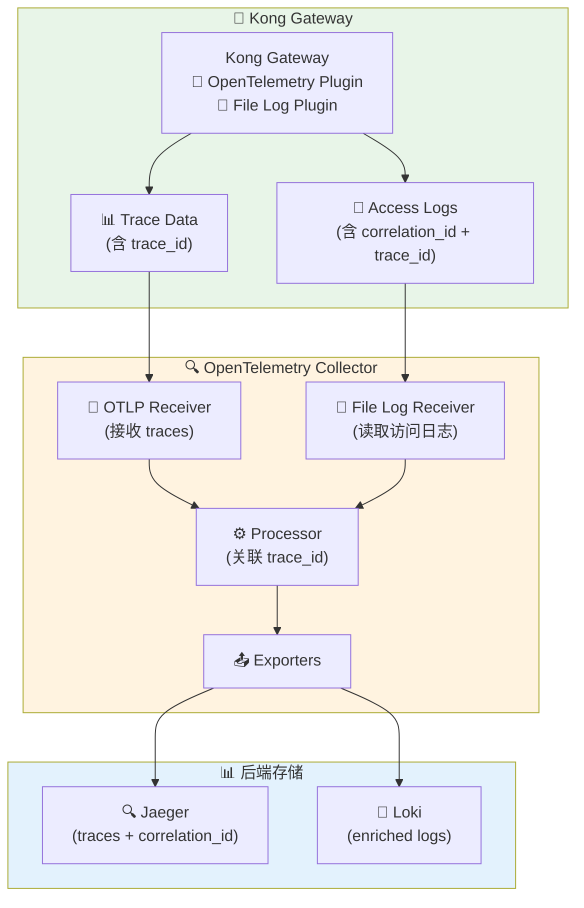

# 🚪 Kong API Gateway 中的 OpenTelemetry 集成与 Correlation ID 获取

> 🎯 深入解析在 Kong 环境中如何通过 OpenTelemetry Collector 获取 correlation ID 的完整解决方案

---

## 🔍 问题分析

### 📋 当前状况
- ✅ **Kong 作为 API Gateway**: 所有 API 请求都经过 Kong
- ✅ **日志中有 correlation ID**: Kong 日志包含 trace ID 和 correlation ID
- ✅ **OpenTelemetry Collector 部署**: 与 Kong 在同一 namespace
- ❌ **插件限制**: Kong OpenTelemetry 插件只能发送 traces，无法直接获取 correlation ID

### 🎯 核心挑战
Kong 的 OpenTelemetry 插件当前版本的限制：
- 🔄 **仅支持 traces**: 不支持直接传递自定义属性如 correlation ID
- 📝 **日志分离**: correlation ID 在访问日志中，但不在 trace 数据中
- 🔗 **关联困难**: trace ID 和 correlation ID 需要手动关联

---

## 🛠️ 解决方案架构

### 🌟 推荐方案：多数据源融合



---

## 🔧 具体实现方案

### 方案 1: 📊 通过日志关联 (推荐)

#### 🚀 Kong 配置

```yaml
# Kong OpenTelemetry 插件配置
apiVersion: configuration.konghq.com/v1
kind: KongPlugin
metadata:
  name: opentelemetry-plugin
  namespace: kong
plugin: opentelemetry
config:
  # OpenTelemetry Collector 端点
  endpoint: "http://otel-collector:4318/v1/traces"
  service_name: "kong-gateway"
  
  # 启用请求和响应头
  header_type: "preserve"
  
  # 采样配置
  sampling:
    type: "probability"
    value: 1.0
  
  # 资源属性
  resource_attributes:
    service.name: "kong-gateway"
    service.version: "3.4.0"
    deployment.environment: "production"

---
# Kong File Log 插件配置
apiVersion: configuration.konghq.com/v1
kind: KongPlugin
metadata:
  name: file-log-plugin
  namespace: kong
plugin: file-log
config:
  # 日志文件路径（需要与 OTel Collector 共享）
  path: "/var/log/kong/access.log"
  
  # 自定义日志格式，包含 correlation ID
  custom_fields_by_lua:
    correlation_id: "return kong.ctx.shared.correlation_id or ngx.var.http_x_correlation_id or ngx.var.request_id"
    trace_id: "return kong.tracing.get_trace_id()"
    span_id: "return kong.tracing.get_span_id()"
    
---
# 应用插件到服务
apiVersion: configuration.konghq.com/v1
kind: KongService
metadata:
  name: my-service
  namespace: kong
  annotations:
    konghq.com/plugins: opentelemetry-plugin,file-log-plugin
spec:
  host: backend-service
  port: 8080
  protocol: http
```

#### 📡 OpenTelemetry Collector 配置

```yaml
# OpenTelemetry Collector 配置
apiVersion: v1
kind: ConfigMap
metadata:
  name: otel-collector-config
  namespace: kong
data:
  config.yaml: |
    receivers:
      # 接收来自 Kong 的 traces
      otlp:
        protocols:
          grpc:
            endpoint: 0.0.0.0:4317
          http:
            endpoint: 0.0.0.0:4318
      
      # 读取 Kong 访问日志
      filelog:
        include: ["/var/log/kong/access.log"]
        operators:
          - type: json_parser
            parse_from: attributes.message
          - type: move
            from: attributes.message.correlation_id
            to: attributes.correlation_id
          - type: move
            from: attributes.message.trace_id
            to: attributes.trace_id
          - type: move
            from: attributes.message.span_id
            to: attributes.span_id
    
    processors:
      # 批处理
      batch:
        timeout: 1s
        send_batch_size: 1024
      
      # 属性处理器 - 关联 correlation ID
      attributes:
        actions:
          # 为 traces 添加 correlation_id（如果日志中有的话）
          - key: correlation_id
            action: upsert
            from_attribute: correlation_id
      
      # 资源检测
      resource:
        attributes:
          - key: service.name
            value: kong-gateway
            action: upsert
          - key: k8s.namespace.name
            value: kong
            action: upsert
    
    # 自定义处理器：关联 trace 和 log 数据
    processors:
      # 使用 transform 处理器进行数据关联
      transform:
        trace_statements:
          - context: span
            statements:
              # 如果存在 correlation_id 属性，将其添加到 span
              - set(attributes["correlation_id"], attributes["correlation_id"]) where attributes["correlation_id"] != nil
        log_statements:
          - context: log
            statements:
              # 确保日志包含 trace 上下文
              - set(trace_id, ParseJSON(body)["trace_id"]) where ParseJSON(body)["trace_id"] != nil
              - set(span_id, ParseJSON(body)["span_id"]) where ParseJSON(body)["span_id"] != nil
    
    exporters:
      # Jaeger exporter
      jaeger:
        endpoint: jaeger:14250
        tls:
          insecure: true
      
      # Loki exporter for logs
      loki:
        endpoint: http://loki:3100/loki/api/v1/push
        labels:
          attributes:
            service.name: "service_name"
            correlation_id: "correlation_id"
      
      # 调试用
      logging:
        loglevel: debug
    
    service:
      pipelines:
        # Traces 管道
        traces:
          receivers: [otlp]
          processors: [batch, attributes, resource, transform]
          exporters: [jaeger, logging]
        
        # Logs 管道
        logs:
          receivers: [filelog]
          processors: [batch, transform]
          exporters: [loki, logging]

---
# Collector Deployment
apiVersion: apps/v1
kind: Deployment
metadata:
  name: otel-collector
  namespace: kong
spec:
  replicas: 1
  selector:
    matchLabels:
      app: otel-collector
  template:
    metadata:
      labels:
        app: otel-collector
    spec:
      containers:
      - name: otel-collector
        image: otel/opentelemetry-collector-contrib:0.88.0
        args: ["--config=/etc/otel-collector-config.yaml"]
        ports:
        - containerPort: 4317
        - containerPort: 4318
        - containerPort: 8889
        volumeMounts:
        - name: config
          mountPath: /etc/otel-collector-config.yaml
          subPath: config.yaml
        - name: kong-logs
          mountPath: /var/log/kong
          readOnly: true
        resources:
          limits:
            memory: 512Mi
            cpu: 200m
          requests:
            memory: 256Mi
            cpu: 100m
      volumes:
      - name: config
        configMap:
          name: otel-collector-config
      - name: kong-logs
        hostPath:
          path: /var/log/kong
          type: DirectoryOrCreate

---
# Service
apiVersion: v1
kind: Service
metadata:
  name: otel-collector
  namespace: kong
spec:
  selector:
    app: otel-collector
  ports:
  - name: otlp-grpc
    port: 4317
    targetPort: 4317
  - name: otlp-http
    port: 4318
    targetPort: 4318
  - name: metrics
    port: 8889
    targetPort: 8889
```

### 方案 2: 🔌 Kong 插件扩展

#### 🛠️ 自定义 Lua 插件

```lua
-- correlation-id-injector.lua
local kong = kong
local ngx = ngx

local CorrelationIdInjector = {
  PRIORITY = 1000, -- 在 OpenTelemetry 插件之前执行
  VERSION = "1.0.0",
}

function CorrelationIdInjector:access(conf)
  -- 获取或生成 correlation ID
  local correlation_id = kong.request.get_header("x-correlation-id")
  
  if not correlation_id then
    -- 生成新的 correlation ID
    correlation_id = kong.tools.uuid.uuid()
    -- 添加到请求头
    kong.service.request.set_header("x-correlation-id", correlation_id)
  end
  
  -- 存储到共享上下文，供其他插件使用
  kong.ctx.shared.correlation_id = correlation_id
  
  -- 添加到响应头
  kong.response.set_header("x-correlation-id", correlation_id)
  
  -- 设置 OpenTelemetry 属性
  local tracing = kong.tracing
  if tracing then
    local span = tracing.active_span()
    if span then
      span:set_attribute("correlation_id", correlation_id)
      span:set_attribute("http.request.header.x_correlation_id", correlation_id)
    end
  end
end

return CorrelationIdInjector
```

#### 📦 插件配置

```yaml
# 自定义插件配置
apiVersion: configuration.konghq.com/v1
kind: KongPlugin
metadata:
  name: correlation-id-injector
  namespace: kong
plugin: correlation-id-injector
config:
  header_name: "x-correlation-id"
  generate_if_missing: true

---
# 修改后的 OpenTelemetry 插件配置
apiVersion: configuration.konghq.com/v1
kind: KongPlugin
metadata:
  name: opentelemetry-plugin-enhanced
  namespace: kong
plugin: opentelemetry
config:
  endpoint: "http://otel-collector:4318/v1/traces"
  service_name: "kong-gateway"
  
  # 包含自定义头部
  header_type: "preserve"
  headers:
    - "x-correlation-id"
  
  # 资源属性
  resource_attributes:
    service.name: "kong-gateway"
    
---
# 服务配置 - 应用两个插件
apiVersion: configuration.konghq.com/v1
kind: KongService
metadata:
  name: my-service-enhanced
  namespace: kong
  annotations:
    konghq.com/plugins: correlation-id-injector,opentelemetry-plugin-enhanced
spec:
  host: backend-service
  port: 8080
  protocol: http
```

### 方案 3: 🔄 Sidecar 模式

#### 📡 Fluent Bit Sidecar 配置

```yaml
# Kong Deployment with Fluent Bit Sidecar
apiVersion: apps/v1
kind: Deployment
metadata:
  name: kong-gateway
  namespace: kong
spec:
  replicas: 3
  selector:
    matchLabels:
      app: kong-gateway
  template:
    metadata:
      labels:
        app: kong-gateway
    spec:
      containers:
      # Kong Gateway 容器
      - name: kong
        image: kong:3.4.0
        ports:
        - containerPort: 8000
        - containerPort: 8443
        env:
        - name: KONG_LOG_LEVEL
          value: "info"
        - name: KONG_ACCESS_LOG
          value: "/var/log/kong/access.log"
        - name: KONG_ERROR_LOG
          value: "/var/log/kong/error.log"
        volumeMounts:
        - name: kong-logs
          mountPath: /var/log/kong
      
      # Fluent Bit Sidecar 容器
      - name: fluent-bit
        image: fluent/fluent-bit:2.2.0
        volumeMounts:
        - name: kong-logs
          mountPath: /var/log/kong
          readOnly: true
        - name: fluent-bit-config
          mountPath: /fluent-bit/etc/
        resources:
          limits:
            memory: 100Mi
            cpu: 50m
          requests:
            memory: 50Mi
            cpu: 25m
      
      volumes:
      - name: kong-logs
        emptyDir: {}
      - name: fluent-bit-config
        configMap:
          name: fluent-bit-config

---
# Fluent Bit 配置
apiVersion: v1
kind: ConfigMap
metadata:
  name: fluent-bit-config
  namespace: kong
data:
  fluent-bit.conf: |
    [SERVICE]
        Flush         1
        Log_Level     info
        Daemon        off
        Parsers_File  parsers.conf

    [INPUT]
        Name              tail
        Path              /var/log/kong/access.log
        Parser            kong_access
        Tag               kong.access
        Refresh_Interval  5
        Mem_Buf_Limit     5MB

    [FILTER]
        Name        parser
        Match       kong.access
        Key_Name    log
        Parser      kong_json
        Reserve_Data On

    [FILTER]
        Name        modify
        Match       kong.access
        Add         source kong-gateway
        Add         log_type access

    # 发送到 OpenTelemetry Collector
    [OUTPUT]
        Name        http
        Match       kong.access
        Host        otel-collector
        Port        4318
        URI         /v1/logs
        Format      json
        Header      Content-Type application/json
        
        # 转换为 OpenTelemetry 日志格式
        json_date_key    timestamp
        json_date_format iso8601

  parsers.conf: |
    [PARSER]
        Name        kong_access
        Format      regex
        Regex       ^(?<remote_addr>[^ ]*) - (?<remote_user>[^ ]*) \[(?<time_local>[^\]]*)\] "(?<method>\S+)(?: +(?<path>[^\"]*?)(?: +\S*)?)?" (?<status>[^ ]*) (?<body_bytes_sent>[^ ]*) "(?<http_referer>[^\"]*)" "(?<http_user_agent>[^\"]*)"
        Time_Key    time_local
        Time_Format %d/%b/%Y:%H:%M:%S %z

    [PARSER]
        Name        kong_json
        Format      json
        Time_Key    timestamp
        Time_Format %Y-%m-%dT%H:%M:%S.%L%z
```

---

## 🎯 最佳实践与优化

### 📊 性能优化建议

#### 1. 🔧 批处理优化
```yaml
# Collector 批处理配置
processors:
  batch:
    timeout: 1s
    send_batch_size: 1024
    send_batch_max_size: 2048
  
  # 内存限制
  memory_limiter:
    limit_mib: 256
    spike_limit_mib: 64
```

#### 2. 📝 日志采样
```yaml
# Kong 采样配置
config:
  sampling:
    type: "probability"
    value: 0.1  # 10% 采样率
```

#### 3. 🎯 属性过滤
```yaml
# 只保留必要属性
processors:
  attributes:
    actions:
      - key: http.request.body
        action: delete
      - key: http.response.body
        action: delete
```

### 🔍 监控和调试

#### 📊 Collector 监控配置
```yaml
# 启用 Prometheus 监控
exporters:
  prometheus:
    endpoint: "0.0.0.0:8889"
    namespace: "otelcol"

service:
  extensions: [health_check, pprof]
  pipelines:
    metrics:
      receivers: [prometheus]
      processors: [batch]
      exporters: [prometheus]
```

#### 🐛 调试配置
```yaml
# 调试模式
exporters:
  logging:
    loglevel: debug
    sampling_initial: 5
    sampling_thereafter: 200

# 文件导出（用于调试）
  file:
    path: /tmp/otel-debug.json
```

### 🔐 安全考虑

#### 1. 🛡️ 敏感数据过滤
```yaml
processors:
  attributes:
    actions:
      # 移除敏感头部
      - key: http.request.header.authorization
        action: delete
      - key: http.request.header.cookie
        action: delete
      # 脱敏 correlation ID（如果需要）
      - key: correlation_id
        action: hash
```

#### 2. 🔒 TLS 配置
```yaml
exporters:
  jaeger:
    endpoint: jaeger:14250
    tls:
      ca_file: /etc/ssl/certs/ca.crt
      cert_file: /etc/ssl/certs/client.crt
      key_file: /etc/ssl/private/client.key
```

---

## 📈 实施路线图

### 🎯 阶段 1：基础实施（1-2周）
1. **📦 部署 OpenTelemetry Collector**
   - 配置基础的 traces 收集
   - 验证 Kong → Collector → Jaeger 链路

2. **📝 配置日志收集**
   - 启用 Kong file-log 插件
   - 配置 Collector 读取访问日志

3. **🔗 实现数据关联**
   - 通过 trace_id 关联 traces 和 logs
   - 验证 correlation_id 可见性

### 🚀 阶段 2：增强功能（2-3周）
1. **🔌 开发自定义插件**（可选）
   - 实现 correlation-id-injector 插件
   - 直接在 traces 中注入 correlation_id

2. **📊 优化性能**
   - 调整采样率和批处理参数
   - 实施资源限制和监控

3. **🔍 完善可观测性**
   - 添加 Collector 自身监控
   - 实现告警和仪表板

### 📋 阶段 3：生产就绪（1-2周）
1. **🛡️ 安全加固**
   - 实施 TLS 加密
   - 配置敏感数据过滤

2. **📈 扩展性优化**
   - 配置 Collector 集群
   - 实现负载均衡

3. **📚 文档和培训**
   - 完善运维文档
   - 团队培训和知识转移

---

## 🎯 总结建议

### ✅ 推荐方案选择

| 场景 | 推荐方案 | 理由 |
|------|----------|------|
| **🚀 快速实施** | 方案 1（日志关联） | 无需修改 Kong 配置，风险最低 |
| **🎯 最佳集成** | 方案 2（自定义插件） | 直接在 traces 中包含 correlation_id |
| **🔧 现有环境** | 方案 3（Sidecar 模式） | 最小化对现有架构的影响 |

### 💡 关键成功因素

1. **📊 数据一致性**: 确保 trace_id 在日志和 traces 中一致
2. **⚡ 性能影响**: 监控额外的日志处理对性能的影响
3. **🔍 可观测性**: 实施完整的监控和告警机制
4. **📈 扩展性**: 考虑未来流量增长的扩展需求

### 🎯 下一步行动

1. **🔬 概念验证**: 在测试环境实施方案 1
2. **📊 性能测试**: 验证对 Kong 性能的影响
3. **🛡️ 安全评估**: 确保敏感数据得到适当保护
4. **📋 制定计划**: 基于测试结果制定详细实施计划

---

> 💡 **关键提示**: correlation ID 的获取需要在 traces 和 logs 之间建立关联。推荐从方案 1 开始，逐步演进到更高级的集成方案。

> 📚 **相关资源**:
> - [Kong OpenTelemetry Plugin 文档](https://docs.konghq.com/hub/kong-inc/opentelemetry/)
> - [OpenTelemetry Collector 配置指南](https://opentelemetry.io/docs/collector/configuration/)
> - [Kong 自定义插件开发](https://docs.konghq.com/gateway/latest/plugin-development/)
