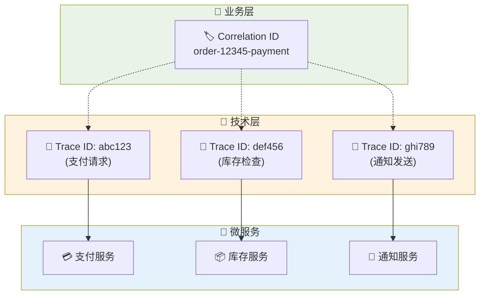
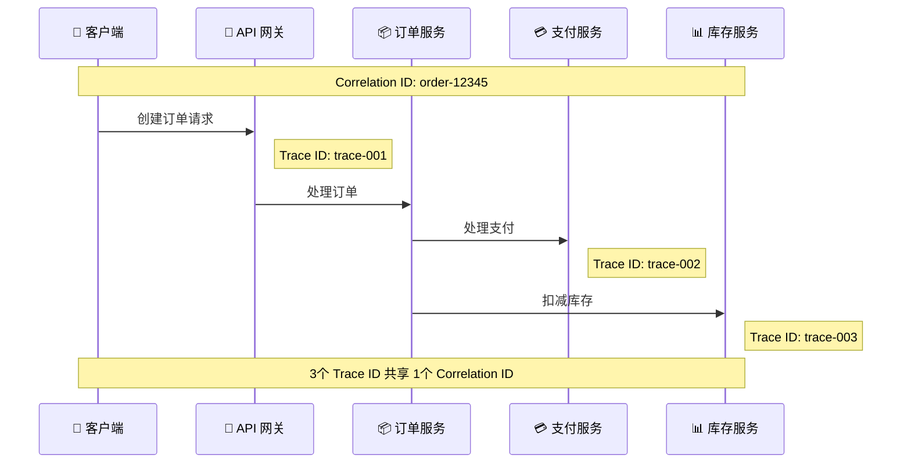
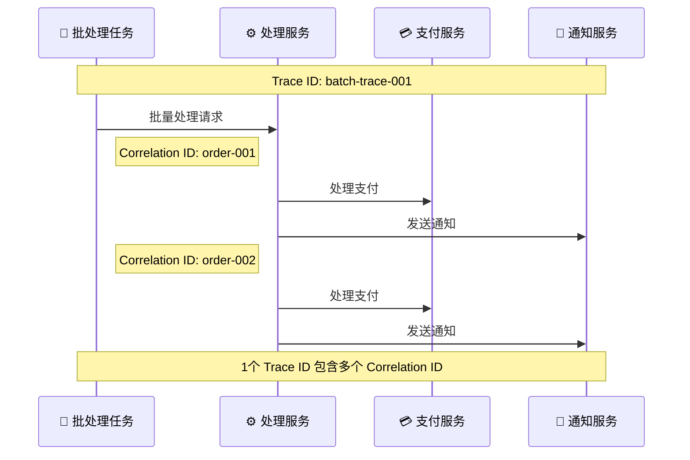
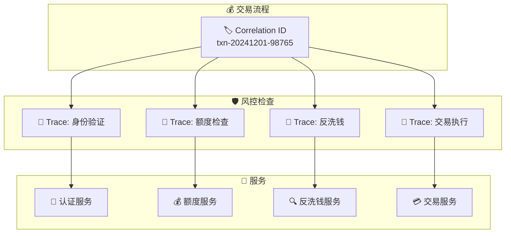
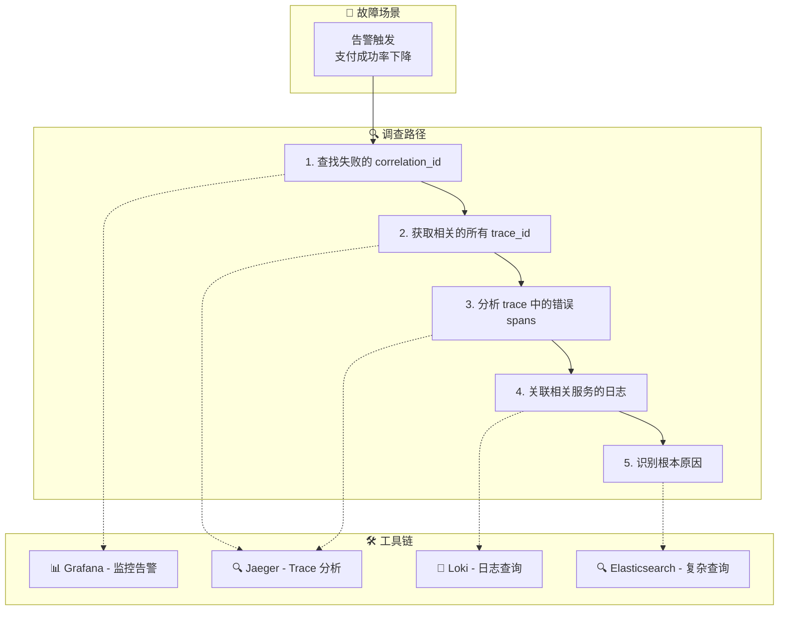

# 🔍 Trace ID vs Correlation ID 深度解析

> 🎯 深入理解分布式系统中两大关键标识符的关系、区别与最佳实践

---

## 📋 核心概念定义

### 🔗 Trace ID
**Trace ID** 是分布式追踪系统中用于标识一个完整请求链路的唯一标识符。

#### 🎯 核心特征
- **📏 固定格式**: 通常为 128 位或 64 位的十六进制字符串
- **🔄 生命周期**: 从请求开始到结束的整个过程
- **🌐 跨服务**: 在所有相关服务中保持一致
- **📊 追踪专用**: 专门为分布式追踪设计

#### 📝 示例
```
Trace ID: 4bf92f3577b34da6a3ce929d0e0e4736
```

### 🏷️ Correlation ID
**Correlation ID** 是业务层面用于关联相关请求或事务的标识符。

#### 🎯 核心特征
- **🎨 灵活格式**: 可以是 UUID、业务编号、或自定义格式
- **💼 业务驱动**: 通常由业务需求决定生成规则
- **🔗 关联性**: 用于关联业务上相关的多个请求
- **📈 持久性**: 可能需要持久化存储用于后续查询

#### 📝 示例
```
Correlation ID: order-12345-payment-retry-3
Correlation ID: user-67890-session-abc123
Correlation ID: batch-job-20241201-001
```

---

## 🔍 详细对比分析

### 📊 功能对比表

| 维度 | Trace ID | Correlation ID |
|------|----------|----------------|
| **🎯 主要用途** | 分布式请求追踪 | 业务请求关联 |
| **🏗️ 生成方式** | 追踪系统自动生成 | 业务系统生成或传递 |
| **📏 格式标准** | OpenTelemetry/Jaeger 标准 | 业务自定义 |
| **⏱️ 生命周期** | 单次请求链路 | 可跨多次请求 |
| **🔄 传播方式** | HTTP Headers/gRPC Metadata | HTTP Headers/业务参数 |
| **💾 存储需求** | 临时存储（追踪期间） | 可能需要持久化 |
| **🔍 查询场景** | 性能分析、错误排查 | 业务流程跟踪 |
| **📈 粒度** | 技术层面（span级别） | 业务层面（事务级别） |

### 🌐 架构层面的区别



---

## 🔄 关系与协作模式

### 🎯 一对多关系
一个 Correlation ID 可能对应多个 Trace ID



### 🔗 多对一关系
多个 Correlation ID 可能在同一个 Trace 中出现



---

## 🛠️ 实际应用场景

### 🎯 场景 1：电商订单处理

#### 💼 业务需求
- 用户下单后需要跟踪整个订单流程
- 订单可能涉及多次支付重试
- 需要关联所有相关的技术调用

#### 🔧 实现策略

```yaml
# 订单处理流程
Business Flow:
  Correlation ID: "order-20241201-12345"
  
Technical Traces:
  - Trace ID: "4bf92f3577b34da6a3ce929d0e0e4736" (下单请求)
  - Trace ID: "7a8c1d4e9f2b5c8a1d4e7f0a3b6c9d2e" (支付处理)
  - Trace ID: "2e5a8b1c4f7d0a3b6c9e2f5a8b1c4f7d" (库存扣减)
  - Trace ID: "9d2e5a8b1c4f7d0a3b6c9e2f5a8b1c4f" (发货通知)
```

#### 📊 数据关联示例

```json
{
  "trace_id": "4bf92f3577b34da6a3ce929d0e0e4736",
  "span_id": "a3ce929d0e0e4736",
  "correlation_id": "order-20241201-12345",
  "business_context": {
    "order_id": "12345",
    "user_id": "67890",
    "session_id": "abc123"
  },
  "technical_context": {
    "service": "order-service",
    "operation": "create_order",
    "timestamp": "2024-12-01T10:30:00Z"
  }
}
```

### 🎯 场景 2：金融交易处理

#### 💼 业务需求
- 交易需要经过多个风控检查
- 每次检查都是独立的技术调用
- 需要完整的审计链路

#### 🔧 实现策略



### 🎯 场景 3：批处理任务

#### 💼 业务需求
- 夜间批量处理用户数据
- 每个用户的处理是独立的业务单元
- 需要跟踪整体批次和单个用户的处理状态

#### 🔧 实现策略

```json
{
  "batch_trace_id": "batch-20241201-001",
  "correlation_id": "batch-20241201",
  "user_processing": [
    {
      "user_correlation_id": "user-67890-process",
      "trace_id": "user-trace-001",
      "status": "completed"
    },
    {
      "user_correlation_id": "user-67891-process", 
      "trace_id": "user-trace-002",
      "status": "failed"
    }
  ]
}
```

---

## 🏗️ 可观测性平台最佳实践

### 🎯 设计原则

#### 1. 📊 分层标识策略

```mermaid
pyramid
    title 标识符层次结构
    
    "🏷️ Correlation ID" : 40 : "业务关联层"
    "🔗 Trace ID" : 30 : "技术追踪层" 
    "🎯 Span ID" : 20 : "操作细节层"
    "📝 Log Event ID" : 10 : "事件记录层"
```

#### 2. 🔄 传播机制设计

```yaml
# HTTP Headers 传播
Headers:
  # OpenTelemetry 标准
  traceparent: "00-4bf92f3577b34da6a3ce929d0e0e4736-a3ce929d0e0e4736-01"
  tracestate: "rojo=00f067aa0ba902b7"
  
  # 业务关联标识
  x-correlation-id: "order-20241201-12345"
  x-request-id: "req-abc123def456"
  x-session-id: "session-xyz789"
  
  # 自定义业务上下文
  x-user-id: "67890"
  x-tenant-id: "tenant-001"
```

#### 3. 📝 日志结构化设计

```json
{
  "timestamp": "2024-12-01T10:30:00.123Z",
  "level": "INFO",
  "message": "Order processing completed",
  
  "trace_context": {
    "trace_id": "4bf92f3577b34da6a3ce929d0e0e4736",
    "span_id": "a3ce929d0e0e4736",
    "parent_span_id": "b4c8d1e5f9a2c6b0"
  },
  
  "business_context": {
    "correlation_id": "order-20241201-12345",
    "order_id": "12345",
    "user_id": "67890",
    "operation": "create_order"
  },
  
  "technical_context": {
    "service": "order-service",
    "version": "1.2.3",
    "instance": "pod-abc123",
    "environment": "production"
  },
  
  "performance_metrics": {
    "duration_ms": 245,
    "cpu_usage": 15.2,
    "memory_mb": 128
  }
}
```

### 🔧 实现配置

#### Kong API Gateway 配置

```yaml
# Kong 插件配置 - 生成和传播标识符
apiVersion: configuration.konghq.com/v1
kind: KongPlugin
metadata:
  name: correlation-id-handler
plugin: correlation-id
config:
  header_name: "x-correlation-id"
  generator: "uuid#counter"
  echo_downstream: true

---
apiVersion: configuration.konghq.com/v1  
kind: KongPlugin
metadata:
  name: opentelemetry-enhanced
plugin: opentelemetry
config:
  endpoint: "http://otel-collector:4318/v1/traces"
  service_name: "kong-gateway"
  
  # 传播业务上下文
  header_type: "preserve"
  headers:
    - "x-correlation-id"
    - "x-request-id"
    - "x-user-id"
    - "x-session-id"
  
  # 资源属性
  resource_attributes:
    service.name: "kong-gateway"
    deployment.environment: "production"
```

#### OpenTelemetry Collector 配置

```yaml
# 增强的 Collector 配置
receivers:
  otlp:
    protocols:
      grpc:
        endpoint: 0.0.0.0:4317
      http:
        endpoint: 0.0.0.0:4318

processors:
  # 属性增强处理器
  attributes:
    actions:
      # 确保 correlation_id 存在
      - key: correlation_id
        action: upsert
        from_attribute: http.request.header.x_correlation_id
      
      # 提取用户上下文
      - key: user_id
        action: upsert
        from_attribute: http.request.header.x_user_id
      
      # 提取会话信息
      - key: session_id
        action: upsert
        from_attribute: http.request.header.x_session_id
  
  # 资源处理器
  resource:
    attributes:
      - key: service.namespace
        value: production
        action: upsert
  
  # 批处理优化
  batch:
    timeout: 1s
    send_batch_size: 1024

exporters:
  # Jaeger - 用于 trace 查询
  jaeger:
    endpoint: jaeger:14250
    tls:
      insecure: true
  
  # Elasticsearch - 用于复杂查询
  elasticsearch:
    endpoints: ["http://elasticsearch:9200"]
    index: "observability-traces"
    mapping:
      mode: "ecs"
  
  # Loki - 用于日志关联
  loki:
    endpoint: http://loki:3100/loki/api/v1/push
    labels:
      attributes:
        service.name: "service_name"
        correlation_id: "correlation_id"
        trace_id: "trace_id"

service:
  pipelines:
    traces:
      receivers: [otlp]
      processors: [attributes, resource, batch]
      exporters: [jaeger, elasticsearch]
```

---

## 📊 查询和分析策略

### 🔍 查询模式设计

#### 1. 🎯 基于 Correlation ID 的业务查询

```sql
-- Jaeger UI / 查询示例
SELECT * FROM traces 
WHERE tags.correlation_id = 'order-20241201-12345'
ORDER BY start_time;

-- Elasticsearch 查询
{
  "query": {
    "bool": {
      "must": [
        {"term": {"correlation_id": "order-20241201-12345"}},
        {"range": {"timestamp": {"gte": "2024-12-01T00:00:00Z"}}}
      ]
    }
  },
  "sort": [{"timestamp": "asc"}]
}
```

#### 2. 🔗 基于 Trace ID 的技术查询

```sql
-- 查找特定 trace 的所有 spans
SELECT * FROM spans 
WHERE trace_id = '4bf92f3577b34da6a3ce929d0e0e4736'
ORDER BY start_time;

-- 查找相关的日志
SELECT * FROM logs 
WHERE trace_id = '4bf92f3577b34da6a3ce929d0e0e4736'
ORDER BY timestamp;
```

#### 3. 🔄 关联查询

```sql
-- 通过 correlation_id 查找所有相关 traces
WITH correlated_traces AS (
  SELECT DISTINCT trace_id 
  FROM traces 
  WHERE tags.correlation_id = 'order-20241201-12345'
)
SELECT t.*, s.* 
FROM traces t
JOIN spans s ON t.trace_id = s.trace_id
WHERE t.trace_id IN (SELECT trace_id FROM correlated_traces)
ORDER BY t.start_time, s.start_time;
```

### 📊 可视化和仪表板

#### Grafana 仪表板配置

```json
{
  "dashboard": {
    "title": "Business Flow Observability",
    "panels": [
      {
        "title": "Correlation ID Timeline",
        "type": "graph",
        "targets": [
          {
            "expr": "histogram_quantile(0.95, rate(http_request_duration_seconds_bucket{correlation_id=\"$correlation_id\"}[5m]))",
            "legendFormat": "95th percentile"
          }
        ]
      },
      {
        "title": "Service Call Map",
        "type": "node-graph",
        "targets": [
          {
            "query": "traces{correlation_id=\"$correlation_id\"}",
            "datasource": "jaeger"
          }
        ]
      },
      {
        "title": "Error Rate by Correlation ID",
        "type": "stat",
        "targets": [
          {
            "expr": "rate(http_requests_total{correlation_id=\"$correlation_id\",status=~\"5..\"}[5m])",
            "legendFormat": "Error Rate"
          }
        ]
      }
    ],
    "templating": {
      "list": [
        {
          "name": "correlation_id",
          "type": "textbox",
          "label": "Correlation ID"
        }
      ]
    }
  }
}
```

---

## 🚀 高级应用场景

### 🎯 场景 1：多租户系统

```yaml
# 多租户标识符策略
Tenant Context:
  tenant_id: "tenant-001"
  correlation_id: "tenant-001-order-12345"
  trace_id: "auto-generated"

# 数据隔离查询
Query Pattern:
  - 按租户过滤: tenant_id = "tenant-001"
  - 业务关联: correlation_id LIKE "tenant-001-%"
  - 技术追踪: trace_id = "specific-trace"
```

### 🎯 场景 2：A/B 测试

```yaml
# A/B 测试标识符
Experiment Context:
  correlation_id: "experiment-checkout-v2-user-67890"
  experiment_id: "checkout-v2"
  variant: "treatment"
  trace_id: "auto-generated"

# 实验结果分析
Analysis:
  - 按实验分组: experiment_id = "checkout-v2"
  - 按变体分析: variant IN ("control", "treatment")
  - 性能对比: GROUP BY variant, measure latency
```

### 🎯 场景 3：故障根因分析



---

## 📈 性能和成本优化

### 🎯 采样策略

#### 智能采样配置

```yaml
# OpenTelemetry Collector 采样配置
processors:
  probabilistic_sampler:
    # 基础采样率
    sampling_percentage: 1.0  # 1%
    
  tail_sampling:
    decision_wait: 10s
    num_traces: 100
    expected_new_traces_per_sec: 10
    policies:
      # 错误请求全采样
      - name: error_policy
        type: status_code
        status_code: {status_codes: [ERROR]}
        
      # 慢请求全采样  
      - name: latency_policy
        type: latency
        latency_threshold: 1000ms
        
      # 特定业务场景全采样
      - name: business_critical
        type: string_attribute
        key: correlation_id
        values: ["payment-.*", "order-.*"]
        invert_match: false
        
      # 其他请求低采样
      - name: default_policy
        type: probabilistic
        probabilistic: {sampling_percentage: 0.1}
```

### 💾 存储优化

#### 数据生命周期管理

```yaml
# Elasticsearch Index Lifecycle Management
PUT _ilm/policy/observability-policy
{
  "policy": {
    "phases": {
      "hot": {
        "actions": {
          "rollover": {
            "max_size": "10GB",
            "max_age": "1d"
          }
        }
      },
      "warm": {
        "min_age": "7d",
        "actions": {
          "allocate": {
            "number_of_replicas": 0
          }
        }
      },
      "cold": {
        "min_age": "30d",
        "actions": {
          "allocate": {
            "number_of_replicas": 0
          }
        }
      },
      "delete": {
        "min_age": "90d"
      }
    }
  }
}
```

---

## 🎯 最佳实践总结

### ✅ 设计原则

1. **🎯 明确职责**
   - Trace ID: 技术层面的请求追踪
   - Correlation ID: 业务层面的流程关联

2. **🔄 一致传播**
   - 在所有服务间保持标识符的一致性
   - 使用标准化的 Header 传播机制

3. **📊 结构化存储**
   - 统一的日志和 trace 数据结构
   - 支持高效查询的索引设计

4. **⚡ 性能优化**
   - 合理的采样策略
   - 智能的数据生命周期管理

### 🔧 实施建议

1. **🚀 渐进式实施**
   - 从核心业务流程开始
   - 逐步扩展到所有服务

2. **📈 监控和调优**
   - 监控标识符的传播效果
   - 持续优化查询性能

3. **👥 团队协作**
   - 统一的标识符命名规范
   - 跨团队的可观测性培训

### 🎯 成功指标

- **🔍 问题定位时间**: 从小时级降到分钟级
- **📊 业务流程可见性**: 100% 关键流程可追踪
- **⚡ 查询性能**: 95% 查询在 3 秒内完成
- **💰 成本效益**: 存储成本控制在合理范围

---

> 💡 **关键洞察**: Trace ID 和 Correlation ID 不是竞争关系，而是互补关系。Trace ID 解决"怎么调用"的问题，Correlation ID 解决"为什么调用"的问题。两者结合使用，能够提供完整的可观测性视图。

> 🚀 **实施建议**: 从业务关键路径开始实施，建立标准化的标识符传播机制，逐步构建完整的可观测性平台。
