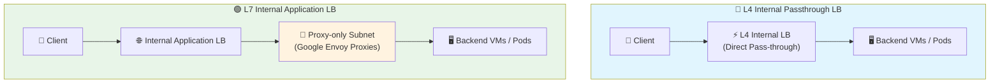
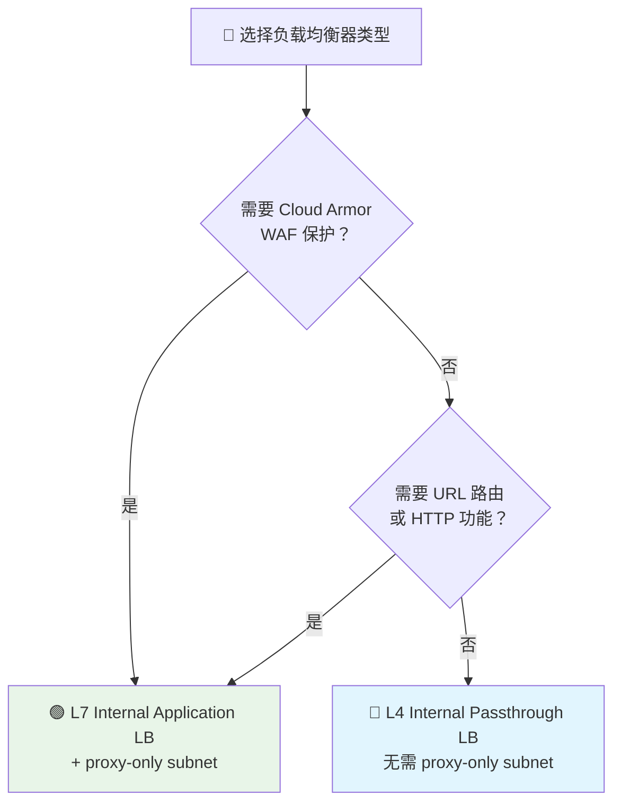

# 🌐 Internal Application LB + Cloud Armor 技术文档

> 📚 深入理解 GCP 内部应用负载均衡器的架构原理与最佳实践

---

## 🔗 1. Internal Application LB 和 Gateway 的关系

### 🏗️ 架构概述

**Internal Application Load Balancer (ILB, INTERNAL_MANAGED)** 的核心特性：

- 🔧 **本质**: Google 托管的 Envoy 代理集群，运行在您的 VPC 内
- 🎯 **功能**: 负责 HTTP(S)/gRPC 的 7 层代理、转发、健康检查、Cloud Armor 策略执行
- ⚙️ **实现**: 创建 ILB 时，GCP 会在后台启动一组 Envoy 实例（Google 代理网关/proxy fleet）

### 🆚 与 GKE Gateway API 的区别

| 特性 | Internal Application LB | GKE Gateway API |
|------|------------------------|-----------------|
| **类型** | 直接的 GCP 资源 | Kubernetes 抽象资源 |
| **管理方式** | 手动创建和管理 | Gateway Controller 自动管理 |
| **底层实现** | 直接调用 GCP LB API | 通过 Controller 调用 GCP LB API |
| **适用场景** | 直接管理 GCP L7 网关 | Kubernetes 原生方式 |

> 💡 **核心理解**: `Internal Application LB = Google 托管的 L7 网关服务`
> 
> - 手动创建 ILB = 直接管理 GCP 的 L7 网关
> - 使用 GKE Gateway API = Gateway Controller 代为创建相同的基础设施

---

## 🛡️ 2. Proxy-only 子网是否必须？

### ✅ 答案：是的，必须的！

#### 🔍 技术原理

- **代理型架构**: Internal Application LB 是代理型负载均衡（Proxy-based LB），区别于四层直通型（Pass-through）LB
- **专用子网**: 需要在 VPC 中分配专门的子网（proxy-only subnet），专门运行 Google 托管的 Envoy 代理实例
- **资源隔离**: 不会在 proxy-only subnet 中运行业务 VM/Pod，仅用于代理服务
- **资源共享**: 每个 Region 至少需要一个 proxy-only subnet，多个 ILB 可以复用同一个子网

#### 📋 官方要求

> ⚠️ **重要提醒**: 创建 ILB 前，必须在 Region 创建一个 `purpose=INTERNAL_HTTPS_LOAD_BALANCER` 的子网

**常见错误**: 如果未创建 proxy-only subnet，会遇到报错：
```
❌ "No proxy-only subnet found in region"
```

---

## 📊 3. L4 vs L7 负载均衡对比

### 🎨 架构对比图



### 📋 详细对比

| 特性 | L4 Internal LB (Passthrough) | L7 Internal Application LB |
|------|------------------------------|----------------------------|
| **🔄 流量处理** | 直通型：客户端直接与后端建立连接 | 代理型：Envoy 代理处理所有连接 |
| **🌐 网络层** | 四层（TCP/UDP） | 七层（HTTP/HTTPS/gRPC） |
| **🔧 Proxy-only Subnet** | ❌ 不需要 | ✅ 必须配置 |
| **🛡️ Cloud Armor 支持** | ❌ 不支持 | ✅ 完全支持 |
| **📝 高级功能** | 基础负载均衡 | URL Map、WAF、Header 注入等 |
| **⚡ 性能** | 更低延迟 | 功能更丰富 |

### 🔍 技术细节

#### L4 Internal LB (Passthrough)
- **连接方式**: 客户端和后端直接建立 TCP/UDP 会话
- **LB 角色**: 仅负责流量分配，不处理应用层内容
- **网络要求**: 无需特殊子网配置

#### L7 Internal Application LB (INTERNAL_MANAGED)
- **连接方式**: 客户端先与 Google Envoy 代理握手，Envoy 再与后端建立新连接
- **IP 分配**: proxy-only subnet 中的 IP 专门分配给 Envoy 实例
- **高级功能**: Cloud Armor、URL Map、WAF、header 注入等都在 Envoy 代理层实现

---

## 🎯 4. 总结与最佳实践

### ✅ 核心结论

| 需求场景 | 推荐方案 | 关键要求 |
|----------|----------|----------|
| **🛡️ 需要 WAF 保护** | L7 Internal Application LB | ✅ 必须配置 proxy-only subnet |
| **⚡ 仅需四层转发** | L4 Passthrough LB | ❌ 无需 proxy-only subnet |
| **🔧 高级路由功能** | L7 Internal Application LB | ✅ 必须配置 proxy-only subnet |
| **📈 简单负载均衡** | L4 Passthrough LB | ❌ 无需特殊配置 |

### 🎯 选择指南



### 💡 最佳实践

1. **🔧 Proxy-only Subnet 管理**
   - 每个 Region 创建一次即可
   - 多个 ILB 可以共享同一个 proxy-only subnet
   - 建议使用专门的 IP 段（如 `10.200.0.0/24`）

2. **🛡️ 安全考虑**
   - 使用 Cloud Armor 时，优先选择 L7 Internal Application LB
   - 在生产环境中，建议先使用 `preview` 模式测试 WAF 规则

3. **⚡ 性能优化**
   - 如果不需要七层功能，L4 Passthrough LB 具有更低的延迟
   - 对于需要高级功能的场景，L7 ILB 提供更丰富的控制能力

---

> 🚀 **下一步**: 查看 [deploy.md](./deploy.md) 了解具体的部署和回滚流程